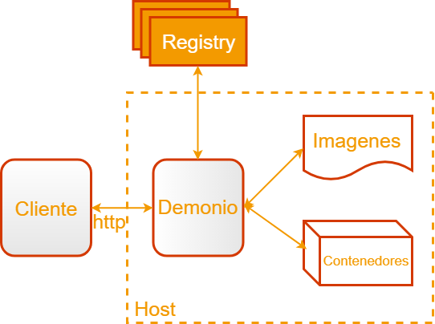
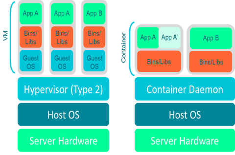

# 🐳 Learning [Docker](https://www.docker.com/play-with-docker)

[📎 diapos keep coding](https://drive.google.com/open?id=1rSof_8W0z7WI4RR7_k4O2-VTKpOyQun-) | [📎 Ejemplos keepcoding](https://drive.google.com/drive/folders/1OvI7_ndFP351gWhrwjS2Y3MpVLmlQyrw)

[🛠 install](https://docs.docker.com/engine/install/) | [🛠 Post install](https://docs.docker.com/engine/install/linux-postinstall/)

🦜 2013 y Código abierto

🦜 Build(contruye) ship and run(transporta y corre) any app(cualquier aplicación) anywhere

## 🐳Docker store

Almacena únicamente imágenes oficiales

## 🐳Docker Hub

Almacena imágenes públicas y oficiales

## 🏗 **Arquitectura Modular**

🦜 **Cliente** Interfaz con la cuál interactua el usuario(mediante instrucciones).

🦜 **Demonio** Proceso principal que corre en la máquina host. Es responsable de:

    ✨ Crear, ejecutar y monitorizar CONTENEDORES

    ✨ Construir y almacenar IMÁGENES



## 🚚 **Contenedor**

🦜 **Paquete** que contiene la app con todo lo necesario para que se ejecute

🦜 Existian antes de docker pero eran complicados de gestionar.

🦜 Proceso aislado de los procesos del sistema operativo.



## 💅 Images

```bash
# listar info sistema
$ docker info

# ver versión instalada
$ docker version

#-------------------------------------------------------------------------------
# $IMAGES
#-------------------------------------------------------------------------------
# buscar imagenes
$ docker search <nameImage>

# descargar images
$ docker pull <nameImage>:<versión(por defecto latest)>

# listar imagenes
$ docker image ls
$ docker image ls -a

# forzar borrar images
$ docker image rm <nameImage>
$ docker image rm -f <nameImage>

# Guardar imágenes (habitual guardarlo en .tar)
$ docker image save --output <Path/nameFichero> <nameImage>:<Version>

# Cargar una imagen que fue guardada
$ docker image load <Path/nameFichero>

#-------------------------------------------------------------------------------
# $Containers
#-------------------------------------------------------------------------------

# construir un contenedor
$ docker container run <nameImage>:<versión> <comando bash a ejecutar>
docker container run centos:6 ls -ltr

# Correr container en segundo plano
$ docker container  run -detach <nameImage>:<version> <comando>
$ docker container  run -d <nameImage>:<version> <comando>

# Asignar un nombre al container(por defecto docker asigna nombres aleatorios)
$ docker container run --name mycentos <nameImage>:<version>

# Correr container mostrando entrada shell
$ docker container -it <nameImage>:<version>
#para salir presionar crtl + p + q
#para volver a entra
$ docker attach <nameContainer ID>

# Mostrar contenedores activos
$ docker container ls
$ docker ps #deprecada ya no debe usarse

# Mostrar todos los contenedores
$ docker container ls -a

# listar los ids de los containers activos
$ docker container ls -q

# Ver info container, variables de entorno(env), config red
$ docker inspect <nameContainer o ID>
# si queremos info especifica ingresamos una clave del JSON ejecutamos
$ docker inspect --format='{{.claveDelJSON}}' <nameContainer ID>

# Parar container sin borrar
$ docker container stop <nameContainer ID>

# Volver arrancar container
$ docker container start <nameContainer ID>

# detener todos los contenedores a la vez
$docker container stop `docker container ls -q`

# borrar container
$ docker container rm <nameContainer ID>
# forzar boorado(borra aunq el container este ejecutandose)
$ docker container rm -f <nameContainer ID>

# borrar container y sus volúmenes
$ docker container rm -v <nameContainer ID>

# ejecutar comandos dentro de un contenedor corriendo
$ docker exec <nameContainer ID> <comando>

# copiar archivos del container a locl
$ docker cp <nameContainer ID>:</PATHCONTAINER> <PathLocal>

# Muestra estadísticas del container
$ docker stats <nameContainer ID>

# mostrar los logs generados hasta el momento
$ docker container logs --details <nameContainer>

#Mostrar logs en tiempo real
$ docker container logs --follow <nameContainer>
```

## 🔐 Seguridad en docker

[📎 Diapos de keepcoding](https://drive.google.com/open?id=1UQwWTItscGiQJewMReRMZIbYgffxtOYF)

🦜 **namespaces** Tener separado los procesos los contenedores no pueden ver otros, tbn se puede
hacer con redes de los contenedores.

🦜 **cgroups** limitar memoria del docker, uso de red

🦜 **linux capabilities** limitar que usuarios se ejecutan dentro del container(no arrancar como root dentro del container)

### [Docker Capabilities](http://man7.org/linux/man-pages/man7/capabilities.7.html)

Limitar las acciones que pueden realizar los usuarios

🦜usar libcap:

```bash
sudo apt install libcap-dev libcap-ng-dev libcap-ng-utils
```

```bash
# eliminar una capability
docker run --rm -it --cap-drop <$CAP sin el CAP> <Imagen> <comando shell>

# agregar una capability
docker run --rm -it --cap-add <$CAP sin el CAP> <Imagen> <comando shell>

#eliminar todo y agregar algunos con comas
docker run --rm -it --cap-drop ALL --cap-add CHOWN alpine sh
docker run --rm -it --cap-drop ALL --cap-add CHOWN ubuntu bash
```

### [Docker Network](https://docs.docker.com/network/#network-drivers)

Limitar el acceso a internet del container

```bash
#por defecto
docker run -it --network=bridge python /bin/bash

#quitar internet
docker run -it --net=none python /bin/bash
```

### Ver que comando a ejecutado el container

```bash
docker history <nameImage>
```

### Verificar que ejecuta y que instala una imagen de docker hub

[📎 Microbadger](https://microbadger.com/)

## Docker content Trust

Forma en que docker prueba firmas de las imagenes que descargas

```bash
export DOCKER_CONTENT_TRUST=1
# Al hacer pull lo primero que hace es comprobar la firma sha
# nginx:latest@sha256:30dfa439718a17baafefadf16c5e7c9d0a1cde97b4fd84f63b69e13513be7097
#sha256:30dfa439718a17baafefadf16c5e7c9d0a1cde97b4fd84f63b69e13513be7097: Pulling from library/nginx
```

## Docker File Security

Incorporar gpg del proveedor para comprobar el soft que instalamos

ejecutar imagenes read-only

no ejecutar el container como root

habilitar user-namespaces

crear usuarios específicos
